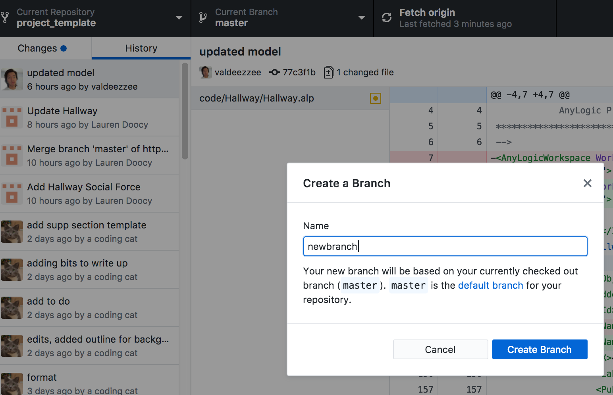

# DELETE: Editing same file simultaneously using GitHub

Step | -
:---: | :---:
Menu | 
Create new branch | 
Publish to GitHub | 
Compare versions | 
Select forks to compare | 
New pull request | 
Merge options | 

# *If You Build It, They Will <s>Come</s> Do What? Extending Helbing's Social Force Model to Examine how Personality Influences Collective Behavior in Built Spaces*

> * Group Name: *2 ∞ & Beyond!*
> * Group participants names: Lauren Doocy, Jihye Song, Jonathan Valderrama
> * IDS 6145 (SimTech 2018)

## Abstract
Helbing's social force model[[1]](#references) proposes that the list of influences on pedestrian movement extends past a desired goal. We seek to model pedestrian movements within various spaces and discuss how individual personality differences affect movements within a system. Additionally, we seek to model how manipulating the environment (e.g., by designing buildings in a certain way) can lead to varying changes in collective behavior as a function of individual differences and social interactions. 
The social force model includes influences of a desired goal, other pedestrians within the system, as well as boarders and walls. 
In addition to this, individual personality traits will affect individual behaviors within a crowd. We seek to understand these individual traits and their influence on behavior within the system.

This research has practical implications for building design to influence collective behavior. 
There has been considerable interest in designing spaces with an explicit intent (e.g., environmental sustainability, safety, enjoyment). 
Using agent based modeling, we seek to simulate the effect of physical spaces on human behavior as a function of personality. Potential real-world applications include:
* Safe evacuation/stampede prevention
* Sustainable behavior (e.g., recycling)
* Healthy behavior (e.g., being more physically active, preventing spread of disease)
* Improving quality of life through design features like elements from nature[[3]](#references)[[4]](#references)
* Collaboration[[5]](#references)

Drawing from Helbing's work on pedestrian simulation, we not only further validate Helbing's social force model, but extend it by adding a new variable to account for personality differences.

## General Introduction

Decades ago, people believed human behavior is unpredictable due to the unreliable behavior or humans. However, it has been shown by numerous scientists that, in fact, the movements of pedestrians can be modeled by already studied substances such as gases and fluids. Helbing took the approach that pedestrians will move with the influence of social forces. He defines such forces as the ultimate goal of the pedestrian in combination with the idea that humans will keep a certain distance from walls and boarders as well as strange people, and will be formally attracted to other pedestrians which the consider a friend[[1]](#references). This causes pedestians to travel and pair and keep a predictable distance from strange groups of people.

Humans perform tasks differently based on individual differences, such as personality type. Personality influences, along with the social force model, must determine the choice path of pedestrians within a system. With a better understanding how individuals react to their environment, we can build an environment that encourages groups of people to perform desired actions. This desired action can include preferred evacuation methods, encouragement of collaboration, or optimal user experience within a space. 
By utilizing an interdisciplinary approach and integrating social science and computational methods, we seek to create a model of social behavior that can be used to inform the design of spaces.

This project makes the following contributions:

1. Scientific Implications
    * Improving our understanding of social behavior using computational methods
    * Integrating interdisciplinary research approaches to form a novel model of social behavior as a function of physical spaces and human characteristics
2. Societal Implications
    * Improved public safety through design of spaces
    * Application of findings to real-world settings to enhance social interaction and collaboration among people

## Background

**TO DO:**

- [ ] Personality theories - OCEAN
- [ ] Social behavior - psych research
- [ ] Building design and human factors
- [ ] ABM and human social behavior - related work

## Social Force Model

The social force model[[1]](#references) describes pedestrian behavior by four actions:

1. Desired direction of movement
2. Repulsive social forces
3. Repulsive forces from walls or any obstacles
4. Attractive social forces

This is described by the equation:

### Desired Direction:

The first term in the social force equation takes into account the pedestrians' desired movement. Each entity will have a defined goal to reach in the shortest distance possible. This term depends on the entity's desired velocity and the entity's actual velocity.

### Repulsive Social Forces:

The second term is a summation of repulsive forces given from other pedestrians in the system. This is known as a repulsive social force. This term depends on the pedestrian's desired direction and the distance from the other pedestrians. Pedestrians desire to keep a distance from strange people and will change directions and velocity to account for this.

### Desired Distance from Walls/Borders:

The third term stands as a summation of the effects of all borders and obstacles present. Each pedestrian will desire to keep a certain distance from walls, furniture, decorations, and other borders. This term takes into account each pedestrian's desired direction and his or her distance from the border. 
Since borders and walls are typically larger than a single point, the point used to calculate distance from border will change dynamically as the closest point to the pedestrian.

### Social Attraction Forces:

The fourth and final defined term in the social force model is the attractive forces. This takes into account that given a shared goal, pedestrians will travel with friends. This term takes into account desired direction, distance from a friendly pedestrian, and time.

### Other Influences
The social force model takes into account random behaviors with a fluctuation term. This could include desired velocities, movements, or personal space preferences based on factors like personality, or random behaviors based on individual decisions to avoid obstacles. 
We predict personality differences influence pedestrian behaviors. In the present study, we draw from the OCEAN model, focusing specifically on the effect of introversion and extroversion on agent behaviors within a simulation. While influences like personality are broadly covered by the fluctuation term, we seek to extend the social force model by identifying and integrating individual variables that influence real human behavior.

## Related Work

Previous research has replicated Helbing's work [**TODO: CITE**] using agent based modeling. 
Additionally, the social force model has been validated using real human motion data[[X]](#references).

Figure from Seer et al., 2014[[X]](#references)

### Our Model
The below diagrams demonstrate potential applications of our work.

##### Requirements

* The model shall produce agent behavior that replicates real observed behavior (assessed looking at real human behavior data)
* The model shall include individual characteristics that each agent will have (e.g., personality type)
* Agents in the model shall behave according to both individual characteristics, as well as social factors
* The model shall simulate collective behavior in different physical environments

## Fundamental Questions
Our overarching goal is to answer several related research questions.

* **Research Question 1**: What theory or theories best explain and predict human behavior?
    * 1a. What individual parameters (e.g., OCEAN personality type, emotion, etc.) need to be included in an agent-based model to represent varying social behaviors dependent on physical structures?
    * 1b. What *combination* of parameters is optimal for replicating and predicting real behavior patterns?

* **Research Question 2**: How can physical structures be designed to facilitate desired group behavior?
    * 2a. What features promote/hinder actions like collaboration?
    * 2b. How do physical structures alter collective behavior?

* **Research Question 3**: To what extent and how do individual differences in people affect how physical structures influence their actions?
    * 3a. Which individual differences are likely to result in varying reactions to physical structures designed to elicit certain behaviors?
    * 3b. How can we optimize building design to account for individual differences in people?

The present study serves as a starting point by examining a single personality variable in combination with the social force model, and how this extended model influences collective behavior differently based on the physical environment.

## Expected Results

We expect that given input from different theories and varying combinations of individual agent parameters, we will see patterns of collective behavior emerge[[6]](#references). 

We also expect that design to nudge human behavior will have varying results based on individual differences.

Below are examples of the type of data we expect to analyze.

## Research Methods

We developed an extended social force and personality model based on the Helbing's social force model, as well as real data from observed human motion. 
To explore our research questions, we utilized agent based modeling. Our model was implemented using AnyLogic software.

First, we created a simplified simulation of a hallway pedestrian scenario to replicate Helbing's work. To build upon this model, we added an additional variable to consider individual personality. 
Specifically, we focused on introversion and extraversion, two diametrically opposed constructs referring to the degree to which

(Steps in the process)

## Results

**TO DO:**

- [ ] Describe methods (in methods section)
- [ ] Add pretty video
- [ ] Data analysis
- [ ] Data visualization

## Discussion
(final only - remove whole section for proposal Readme) 
(What would you have done differently) 

(what is the big take away)
(what did you learn)

Our results suggest ___

### Limitations and Future Work
(final only - remove whole section for proposal Readme) (if you had 6 more months what would be the next steps in this project.) (What are a few questions you have now)

We sought to determine whether the social force model could be extended by defining additional variables. To this end, our initial study focused on one personality variable. 
While relatively simple models can replicate human social behavior with significant accuracy, future work should seek to add additional parameters to account for the complexity of human behavior, personality, and other factors influencing actions. 
Future research should explore the degree to which the behavior of increasingly complex agents approaches that of humans, and if there are certain variables or optimal combinations of variables that improve the accuracy of an agent-based model of human social behavior.

## Conclusion
In sum, this study serves as a starting point to inform future work using agent based modeling for building design. 

## Author Contributions
All authors contributed to concept formation and study design.

JS developed research questions, JV developed conceptual models, and LD developed mathematical functions to inform agent behavior. 

All authors contributed to final version of the project.

## Acknowledgements
We thank Joe2 {Kider, del Rocco} for their guidance and advice throughout the semester while conceptualizing and completing this project.

## Supplemental Materials
(change the title and amount of headers as needed) (mention datasets you are going to use) (mention base code or examples you)

**TO DO:**

- [ ] Sample code?
- [ ] Link to Anylogic file(s)
- [ ] Link to raw data/results

## References

[[1]](#abstract) Helbing, D., & Molnar, P. (1995). Social force model for pedestrian dynamics. *Physical Review E, 51*(5), 4282. [DOI](https://doi.org/10.1103/PhysRevE.51.4282)

[[2]](#abstract) Durupinar, F., Pelechano, N., Allbeck, J., Gudukbay, U., & Badler, N. I. (2011). How the ocean personality model affects the perception of crowds. *IEEE Computer Graphics and Applications, 31*(3), 22-31. [DOI](https://doi.org/10.1109/MCG.2009.105)

[[3]](#abstract) Kaplan, S. (1995). The restorative benefits of nature: Toward an integrative framework. *Journal of Environmental Psychology, 15*(3), 169-182. [DOI](https://doi.org/10.1016/0272-4944(95)90001-2)

[[4]](#abstract) Ulrich, R. S. (1979). Visual landscapes and psychological well‐being. *Landscape Research, 4*(1), 17-23. [DOI](https://doi.org/10.1080/01426397908705892)

[[5]](#abstract) Pinter-Wollman, N., Fiore, S. M., & Theraulaz, G. (2017). The impact of architecture on collective behaviour. *Nature Ecology & Evolution, 1*(5), s41. [DOI](https://doi.org/10.1038/s41559-017-0111)

[[6]](#expected-results) Smaldino, P. E., & Epstein, J. M. (2015). Social conformity despite individual preferences for distinctiveness. *Royal Society Open Science, 2*(3), 140437. [DOI](https://doi.org/10.1098/rsos.140437)

[[X]](#background) Seer, S., Rudloff, C., Matyus, T., & Brändle, N. (2014). Validating social force based models with comprehensive real world motion data. *Transportation Research Procedia, 2*, 724-732. [DOI](https://doi.org/10.1016/j.trpro.2014.09.080)

[[X]](#research-methods) Eysenck, H. J. (1952). *The scientific study of personality.* Oxford, England: Macmillan.