# How to pull request here: https://github.com/ldoocy/project_template/wiki/How-to-GitHub

# *If You Build It, They Will <s>Come</s> Do What? Extending Helbing's Social Force Model to Examine how Personality Influences Collective Behavior in Built Spaces*

> * Group Name: *2 ∞ & Beyond!*
> * Group participants names: Lauren Doocy, Jihye Song, Jonathan Valderrama
> * IDS 6145 (SimTech 2018)

## Abstract
The social force model [(Helbing & Molnar, 1995)](#references) proposes that the list of influences on pedestrian movement extends past a desired goal. We seek to model pedestrian movements within various spaces and discuss how individual personality differences affect movements within a system. 
Additionally, we seek to model how manipulating the environment (e.g., by designing buildings in a certain way) can lead to varying changes in collective behavior as a function of individual differences and social interactions. 
The social force model includes influences of a desired goal, other pedestrians within the system, as well as boarders and walls. 
In addition to this, individual personality traits will affect individual behaviors within a crowd. We seek to understand these individual traits and their influence on behavior within the system.

This research has practical implications for building design to influence collective behavior. 
There has been considerable interest in designing spaces to influence human behavior. 
Potential real-world applications include safe evacuation (e.g., stampede prevention), sustainable behavior (e.g., recycling), healthy behavior (e.g., being more physically active, preventing spread of disease), design to improve quality of life through design features like elements from nature ([Kaplan, 1995; Ulrich, 1979](#references)), and collaboration ([Pinter-Wollman, Fiore, & Theraulaz, 2017](#references); see Figure 1 for example).
Using an interdisciplinary approach to integrate agent based modeling and social science, we seek to simulate the effect of physical spaces on human behavior as a function of personality. 

Drawing from Helbing's work on pedestrian simulation, we not only further validate the original social force model, but extend it by adding a new variable to account for personality differences.

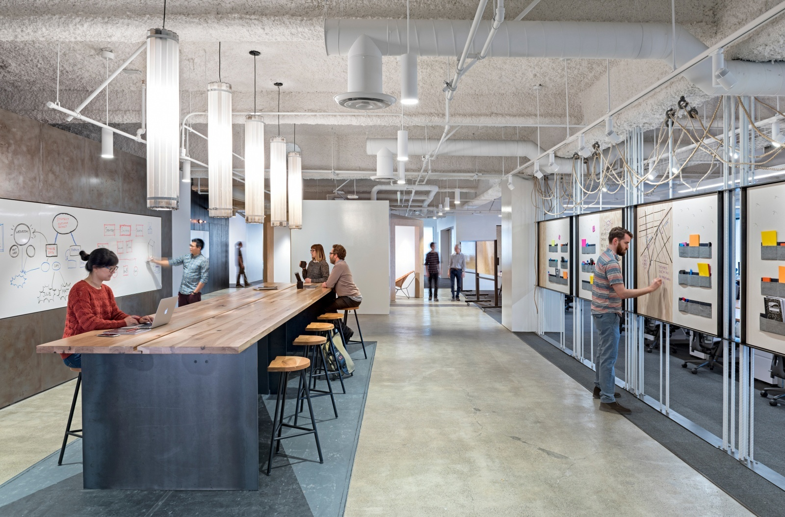

*Figure 1. Uber office space designed for collaboration.*

## Introduction

Modeling large-scale human behavior has gained significant interest across disciplines, and 

Decades ago, people believed human behavior is unpredictable due to the unreliable behavior or humans. However, it has been shown by numerous scientists that, in fact, the movements of pedestrians can be modeled by already studied substances such as gases and fluids. Helbing took the approach that pedestrians will move with the influence of social forces. He defines such forces as the ultimate goal of the pedestrian in combination with the idea that humans will keep a certain distance from walls and boarders as well as strange people, and will be formally attracted to other pedestrians which the consider a friend[[1]](#references). This causes pedestians to travel and pair and keep a predictable distance from strange groups of people.

Humans perform tasks differently based on individual differences, such as personality type. Personality influences, along with the social force model, must determine the choice path of pedestrians within a system. With a better understanding how individuals react to their environment, we can build an environment that encourages groups of people to perform desired actions. This desired action can include preferred evacuation methods, encouragement of collaboration, or optimal user experience within a space. 
By utilizing an interdisciplinary approach and integrating social science and computational methods, we seek to create a model of social behavior that can be used to inform the design of spaces.

This project makes the following contributions:

1. Scientific Implications
    * Improving our understanding of social behavior using computational methods
    * Integrating interdisciplinary research approaches to form a novel model of social behavior as a function of physical spaces and human characteristics
2. Societal Implications
    * Improved public safety through design of spaces
    * Application of findings to real-world settings to enhance social interaction and collaboration among people

## Background

**TO DO:**

- [ ] Personality theories - OCEAN
- [ ] Social behavior - psych research
- [ ] Building design and human factors
- [ ] ABM and human social behavior - related work

## Social Force Model

The social force model [(Helbing & Molnar, 1995)](#references) describes pedestrian behavior by four actions:

1. Desired direction of movement
2. Repulsive social forces
3. Repulsive forces from walls or any obstacles
4. Attractive social forces

This is described by the equation:

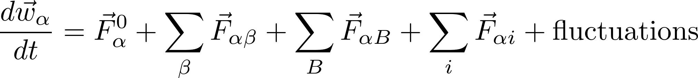

### Equation Terms

Each agent will have a defined goal to reach in the shortest distance possible. This term depends on the agent's desired velocity and actual velocity. 
Thus, the first term in the social force equation takes into account the agents' desired movement, defined as:

| Desired Direction |
| :---: |
| 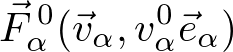 | 

The second term is a summation of repulsive forces given from other agents in the system. This term depends on the agent's desired direction and distance from other agents. 
Agents desire to keep a minimum distance from strange people and will change directions and velocity to account for this. This is known as a repulsive social force:

| Repulsive Social Forces |
| :---: |
| 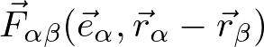 |

The third term stands as a summation of the effects of all borders and obstacles present. Each agent desires to keep a certain distance from walls, furniture, decorations, and other borders. 
This term takes into account each agent's desired direction and his or her distance from the border. 
Since borders and walls are typically larger than a single point, the point used to calculate distance from border will change dynamically as the closest point to the agent. This term is defined as:

| Desired Distance from Walls/Borders |
| :---: |
|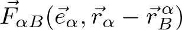 |

Finally, the fourth defined term in the social force model is the attractive forces. This takes into account that given a shared goal, agents will travel with friends. This term takes into account desired direction, distance from a friendly pedestrian, and time:

| Social Attraction Forces |
| :---: |
| 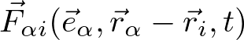 |

#### Other Influences
In addition to the terms defined above, the social force model takes into account random behaviors with a fluctuation term. This could include desired velocities, movements, or personal space preferences based on factors like personality, or random behaviors based on individual decisions to avoid obstacles. 
We predict personality differences influence pedestrian behaviors. In the present study, we draw from the OCEAN model, focusing specifically on the effect of introversion and extraversion on agent behaviors within a simulation. While influences like personality are broadly covered by the fluctuation term, we seek to extend the social force model by identifying and integrating individual variables that influence real human behavior.

## Related Work

Previous research has replicated Helbing's original work using agent based modeling ([Helbing, Buzna, Johansson, & Werner, 2005](#references); see Figure 2). 
Additionally, the social force model has been validated using real human motion data ([Seer, Rudloff, Matyus, & Brändle, 2014](#references); see Figure 3).

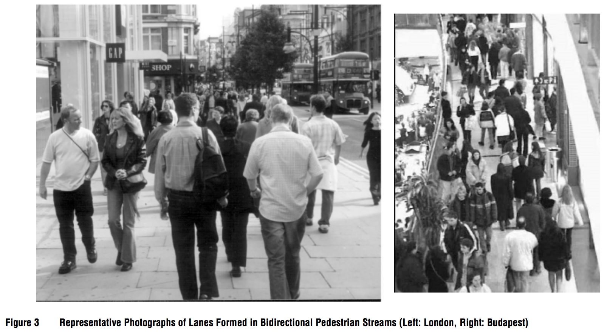

*Figure 2. Self-organized lanes among pedestrians [(Helbing et al., 2005)](#references).*

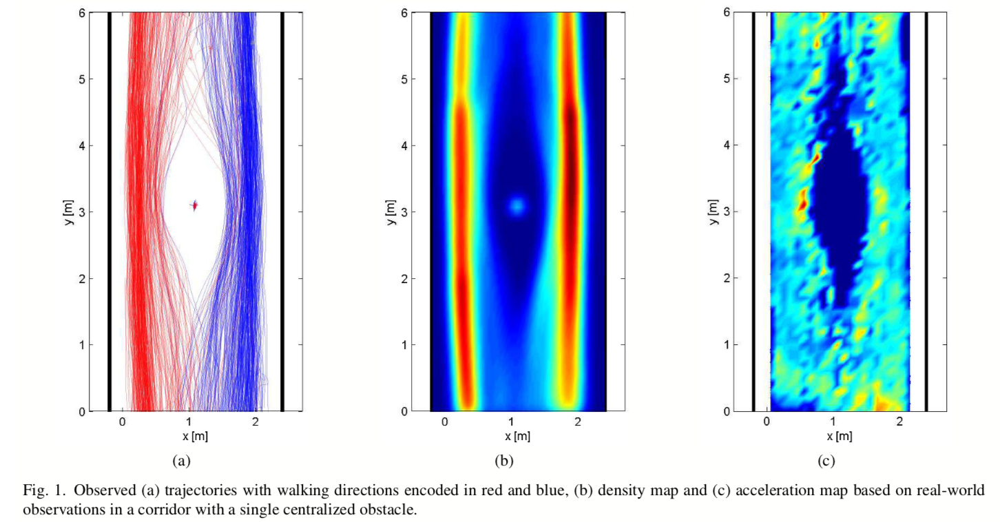

*Figure 3. Navigation patterns in real human motion [(Seer et al., 2014)](#references).*

### Our Model
The first term represents the desired movement term. This force will represent the force moving the agent toward their desired destination. This term depends on initial velocity, desired velocity, as well as the agent's distance from goal.

The second term represents a change in an agent's behaviors due to other agents within a certain radius. This term depends on the desired direction of another agent and the distance from the other agent. This accounts for the repulsive social force of another agent which future behavior may be unknown. This term is a summation of individually calculated terms with respect to all agents within some defined radius.

This term is where personality differences may vary. The Helbing model defines this force term as a term with exponential decay, such that

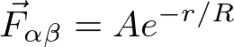

where as the repulsion force is smaller for small distance r. As agents move away from each other, the force decays expontentially. In the current Social Force model, the scale R is held constant. We propose that this parameter is defined by the personality type of the agent. A small value for R will cause less of a repulsive force for pedestrians with an extroverted personality. On the other hand, pedestrians with an introverted personality will be more likely to move way from strangers, requiring a larger value of R.

The final term of the modified Social force model is the repulsive force of walls and boarders. Pedestrians are less likely to walk close to a wall, therefore this will be dependent on the agent's distance from the closest point on the wall or boarder.

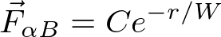

Here, both constants C and W are held constant as personality type does not affect behavior towards wall avoidance.

The Social Force Model accounts for changes in desired velocities, movements and personal preferences with a catch all team identified by fluctuations. We propose that personality type plays a significant role in movement preferences that can be more accuratley accounted for outside of a fluctuation term. Personality type will affect individual pedestrian's desired velocity and personal space preferences.

The social force model describes desired velocity as chosen from a random distribution. While it is true that a crowd of people will have desired velocities chosen from some distribution, we suggest that it is, in fact, related to the individual's personality.

On the other hand, the notion of personal space is accounted for in the fluctionations term. This also is suggested to correlate with personality type. Some individuals are more likely to let strangers approach them where as others may be much more apprehensive. We believe this may be accounted for within the repulsive social forces term. This would allow the more fearful individuals to react more strongly to other agents, and the agents with a less sensive personal space to react less strongly.

##### Requirements

* The model shall produce agent behavior that replicates human behavior under similar circumstances (assessed looking at real human behavior data)
* The model shall include individual characteristics that each agent will have (e.g., personality type)
* Agents in the model shall behave according to both individual characteristics, as well as social factors
* The model shall simulate collective behavior in different physical environments

## Fundamental Questions
Our overarching goal is to answer several related research questions.

* **Research Question 1**: What theory or theories best explain and predict human behavior?
    * 1a. What individual parameters (e.g., OCEAN personality type, emotion, etc.) need to be included in an agent-based model to represent varying social behaviors dependent on physical structures?
    * 1b. What *combination* of parameters is optimal for replicating and predicting real behavior patterns?

* **Research Question 2**: How can physical structures be designed to facilitate desired group behavior?
    * 2a. What features promote/hinder actions like collaboration?
    * 2b. How do physical structures alter collective behavior?

* **Research Question 3**: To what extent and how do individual differences in people affect how physical structures influence their actions?
    * 3a. Which individual differences are likely to result in varying reactions to physical structures designed to elicit certain behaviors?
    * 3b. How can we optimize building design to account for individual differences in people?

The present study serves as a starting point by examining a single personality variable in combination with the social force model, and how this extended model influences collective behavior differently based on the physical environment.

## Expected Results

We expect that given input from different theories and varying combinations of individual agent parameters, we will see patterns of collective behavior emerge[[6]](#references). 

We also expect that design to nudge human behavior will have varying results based on individual differences.

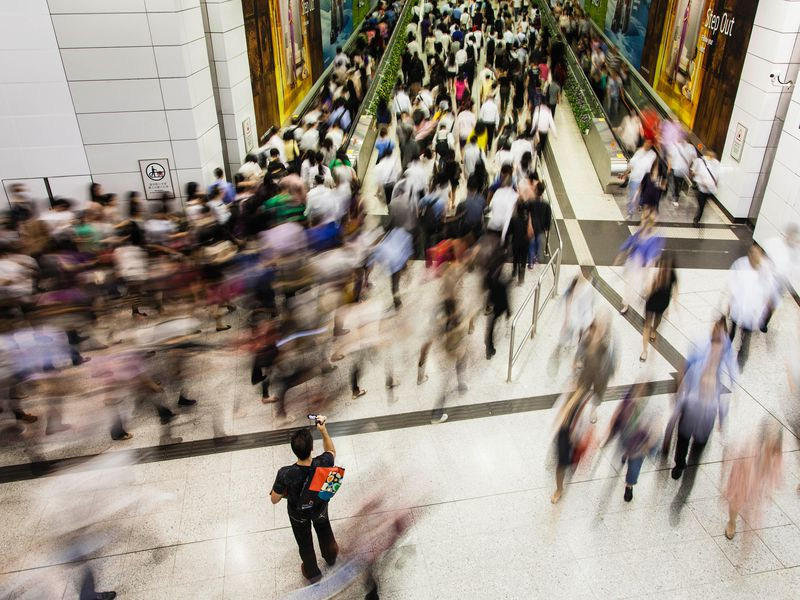

Below are examples of the type of data we expect to analyze.

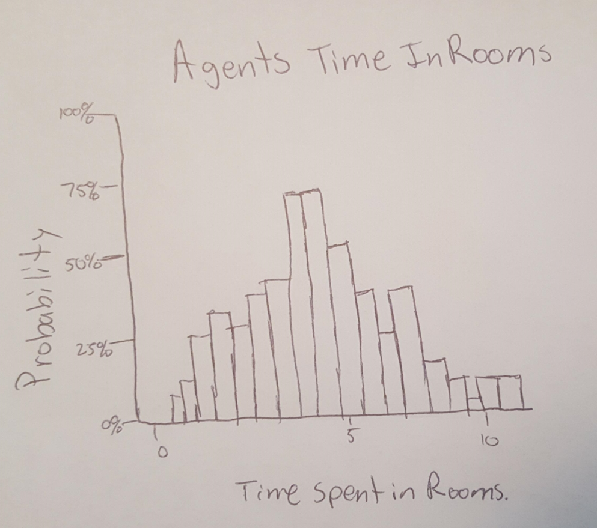

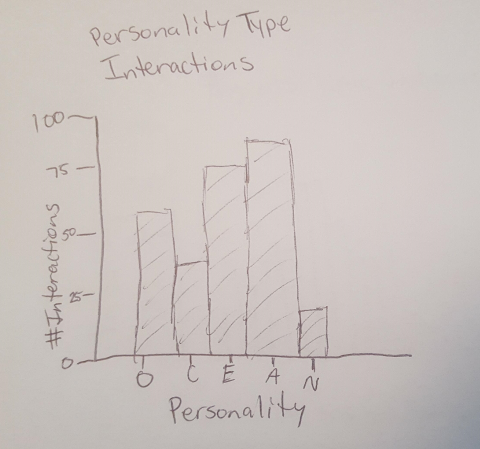

## Methods

We developed an extended social force and personality model based on the Helbing's social force model, as well as real data from observed human motion. 
To explore our research questions, we utilized agent based modeling. Our model was implemented using AnyLogic software.

First, we created a simplified simulation of a hallway pedestrian scenario to replicate previous research on the social force model ([Helbing & Molnar, 1995](#references)). 
For the current study, we utilized AnyLogic simulation software to implement the model. 

# TODO: *Insert methods here*

* 

Then, to build upon this model, we added an additional variable to consider individual personality. 
Specifically, for this preliminary study, we focused on introversion and extraversion, two diametrically opposed constructs that influence social behavior and interpersonal interactions ([Eysenck, 1952](#references)). 
To examine the effect of personality differences on collective behavior, we manipulated environment and crowd composition (i.e., whether all pedestrians have the same personality or have mixed personality types). From this, we created the following conditions:

Condition | Description
:--- | :---
Control | Baseline parameters to compare other conditions
All extraverted |  All agents are high in extraversion
All introverted | All agents are high in introversion
Mixed by direction | All agents from the left are introverted; all agents from the right are extraverted (i.e., agent personality varies depending on direction of travel)
Mixed - dispersed | Introversion/extraversion are normally distributed among all agents (i.e., most people are closer to center, with fewer people at extremes)

(Steps in the process)

## Results

**TO DO:**

- [ ] Describe methods (in methods section)
- [ ] Add pretty video
- [ ] Data analysis
- [ ] Data visualization

## Discussion
(final only - remove whole section for proposal Readme) 
(What would you have done differently) 

(what is the big take away)
(what did you learn)

First, we successfully replicated the social force model in AnyLogic and observed emergent patterns of pedestrian behavior in a hallway navigation scenario. 
Additionally, varying agent parameters based on introversion and extraversion led to significant differences in both individual agent behavior, as well as patterns of collective behavior.
Our results suggest that taking additional human traits into consideration can yield more accurate and realistic modeling and simulation of human behavior, both at the individual level, and on a larger scale.

### Limitations and Future Work
(final only - remove whole section for proposal Readme) (if you had 6 more months what would be the next steps in this project.) (What are a few questions you have now)

We sought to determine whether the social force model could be extended by defining additional variables. While there are numerous variables to consider, our initial study only focused on one personality variable (i.e., the introversion-extraversion continuum). 
While relatively simple models can replicate human social behavior with significant accuracy, future work should seek to add additional parameters to account for the complexity of human behavior, personality, and other factors influencing actions. 
Future research should explore the degree to which the behavior of increasingly complex agents approaches that of humans, and if there are certain variables or optimal combinations of variables that improve the accuracy of an agent-based model of human social behavior.

## Conclusion
In sum, this study serves as a starting point to inform future work using agent based modeling for building design. 

## Author Contributions
All authors contributed to concept formation and study design.

JS refined research questions, JV developed conceptual models, and LD developed mathematical functions to inform agent behavior. 

All authors contributed to final version of the project.

## Acknowledgements
We thank Joe2 {Kider, del Rocco} for their guidance and advice throughout the semester while conceptualizing and completing this project.

## Supplemental Materials
(change the title and amount of headers as needed) (mention datasets you are going to use) (mention base code or examples you)

* [AnyLogic files](code)

**TO DO:**

- [ ] Sample code?
- [X] Link to Anylogic file(s)
- [ ] Link to raw data/results

## References

[^](#abstract) Durupinar, F., Pelechano, N., Allbeck, J., Gudukbay, U., & Badler, N. I. (2011). How the ocean personality model affects the perception of crowds. *IEEE Computer Graphics and Applications, 31*(3), 22-31. [DOI](https://doi.org/10.1109/MCG.2009.105)

[^](#research-methods) Eysenck, H. J. (1952). *The scientific study of personality.* Oxford, England: Macmillan.

[^]() Guy, S. J., Kim, S., Lin, M. C., & Manocha, D. (2011, August). Simulating heterogeneous crowd behaviors using personality trait theory. In *Proceedings of the 2011 ACM SIGGRAPH/Eurographics Symposium on Computer Animation* (pp. 43-52). ACM.

[^](#background) Helbing, D., Buzna, L., Johansson, A., & Werner, T. (2005). Self-organized pedestrian crowd dynamics: Experiments, simulations, and design solutions. *Transportation Science, 39*(1), 1-24.

[^](#abstract) Helbing, D., & Molnar, P. (1995). Social force model for pedestrian dynamics. *Physical Review E, 51*(5), 4282. [DOI](https://doi.org/10.1103/PhysRevE.51.4282)

[^](#abstract) Kaplan, S. (1995). The restorative benefits of nature: Toward an integrative framework. *Journal of Environmental Psychology, 15*(3), 169-182. [DOI](https://doi.org/10.1016/0272-4944(95)90001-2)

[^](#abstract) Pinter-Wollman, N., Fiore, S. M., & Theraulaz, G. (2017). The impact of architecture on collective behaviour. *Nature Ecology & Evolution, 1*(5), s41. [DOI](https://doi.org/10.1038/s41559-017-0111)

[^](#background) Seer, S., Rudloff, C., Matyus, T., & Brändle, N. (2014). Validating social force based models with comprehensive real world motion data. *Transportation Research Procedia, 2*, 724-732. [DOI](https://doi.org/10.1016/j.trpro.2014.09.080)

[^](#expected-results) Smaldino, P. E., & Epstein, J. M. (2015). Social conformity despite individual preferences for distinctiveness. *Royal Society Open Science, 2*(3), 140437. [DOI](https://doi.org/10.1098/rsos.140437)

[^](#abstract) Ulrich, R. S. (1979). Visual landscapes and psychological well‐being. *Landscape Research, 4*(1), 17-23. [DOI](https://doi.org/10.1080/01426397908705892)

