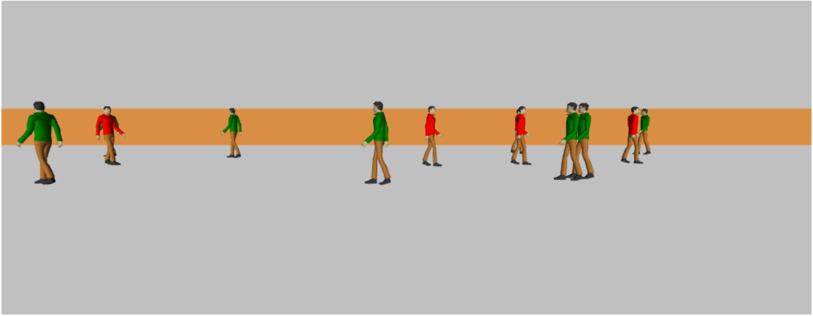
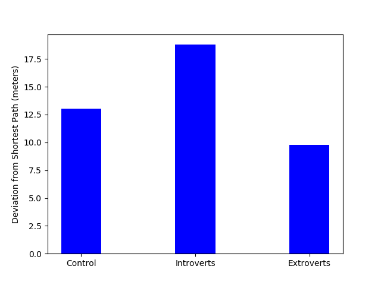
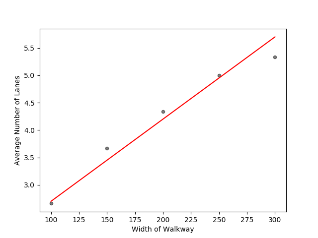

# *If You Build It, They Will <s>Come</s> Do What? Extending the Social Force Model to Examine how Personality Influences Collective Behavior in Built Spaces*

> * Group Name: *2 ∞ & Beyond!*
> * Group participants names: Lauren Doocy, Jihye Song, Jonathan Valderrama
> * IDS 6145 (SimTech 2018)

## Abstract
The social force model [(Helbing & Molnar, 1995)](#references) offers a modeling approach that considers how factors influencing pedestrian movement extend past merely pursuing a desired destination. 
The social force model includes influences of a desired goal, other pedestrians within the system, and obstacles. We first replicate previous research on the social force model to demonstrate its utility in the development of more complex modeling approaches. 
We turn to agent-based modeling (ABM) to explore how individual personality differences affect movements within a system, both at the individual and crowd level. 
Additionally, we seek to model how manipulating the environment (e.g., by designing buildings in a certain way) can lead to varying changes in collective behavior as a function of individual differences and social interactions. 
In this preliminary study, using the social force model as a starting point, we isolate the effect of introversion and extraversion on individual and collective behavior, and examine the effect of environmental characteristics on collective behavior.

Ultimately, we seek to develop a model that can inform building design to influence collective behavior. 
Potential real-world applications include safe evacuation (e.g., stampede prevention), sustainable behavior (e.g., recycling), healthy behavior (e.g., being more physically active, preventing spread of disease), design to improve quality of life through design features like elements from nature ([Kaplan, 1995; Ulrich, 1979](#references)), and collaboration ([Pinter-Wollman, Fiore, & Theraulaz, 2017](#references); see Figure 1 for example).
Using an interdisciplinary approach to integrate ABM and social science, we seek to simulate the effect of physical spaces on human behavior as a function of personality. 
Drawing from Helbing's work on pedestrian simulation, we not only further validate the original social force model using AnyLogic (Personal Learning Edition 8.2.3; [AnyLogic, 2017](#references)), but extend it by adding a new variable to account for personality differences.

|  |
| :--- |
| <sup>*Figure 1. Uber office space designed for collaboration.*</sup> |

## Introduction

Modeling large-scale human behavior has gained significant interest across disciplines, and despite the complexity of cognitive processes underlying human behavior and social interactions, simplified models can be used to approximate and replicate human behavior. 
For instance, pedestrian movement can be modeled based on movement of gases and fluids. Helbing proposed that pedestrians move based on the influence of social forces that take into account the ultimate goal of the pedestrian in combination with the idea that individuals will keep a certain distance from walls and borders as well as strange people, 
and will also be formally attracted to other pedestrians according to degree of social relationship ([Helbing & Molnar, 1995](#references)). This causes pedestrians to form groups with friends, as well keep a predictable distance from strangers.

While the social force model has received considerable attention for its ability to replicate crowd behavior, in reality, humans perform tasks differently based on individual differences, such as personality type, and these differences are not explicitly included in the model. We suggest that personality influences, along with the social force model, can determine the choice path of agents within a system and provide a realistic simulation of collective behavior. 
By utilizing an interdisciplinary approach and integrating social science and computational methods, we seek to create a model of social behavior that provides insight into how different individuals behave in different environments in order to improve the design of spaces.

This project makes the following contributions:

1. Scientific Implications
    * Improving our understanding of social behavior using computational methods
    * Integrating interdisciplinary research approaches to form a novel model of social behavior as a function of physical spaces and human characteristics
2. Societal Implications
    * Improved public safety through design of spaces
    * Application of findings to real-world settings to enhance social interaction among people

## Background
### Social Behavior and Personality

Humans are social animals by nature, and our survival depends on our ability to navigate social interactions successfully. 
Even when seeking distinctiveness, human behavior tends to converge to form observable patterns within groups, and this tendency to conform has been well-documented in psychology research (e.g., [Asch, 1951](#references)). 
Formal models have also demonstrated the strong tendency for agents to conform despite a desire for distinctiveness ([Smaldino & Epstein, 2015](#references)).

Personality theories have persisted as a major topic of interest in the field of psychology, with numerous approaches attempting to explain and describe the features that compose personality over decades of research. 
More recently, personality theories have gained attention within ABM, with the big-five, or OCEAN  model ([Goldberg, 1990](#references)) being of particular interest. 
The OCEAN model describes basic dimensions of human personality based on where individuals fall on five major continua: openness, conscientiousness, extraversion, agreeableness, and neuroticism. Combinations of varying degrees of these traits result in different personality types, which then influence behavior and interpersonal relationships. 
This relatively new approach to ABM builds upon earlier formal models of human behavior in an attempt to create more realistic models that take complex personality traits into account when determining how agents behave.

### Social Force Model

The social force model [(Helbing & Molnar, 1995)](#references) describes pedestrian behavior by four actions:

1. Desired direction of movement
2. Repulsive social forces
3. Repulsive forces from walls or any obstacles
4. Attractive social forces

This is described by the equation:


#### Equation Terms

Each agent will have a defined goal to reach in the shortest distance possible. This term depends on the agent's desired velocity and actual velocity. 
Thus, the first term in the social force equation takes into account the agents' desired movement, defined as:

| Desired Direction |
| :---: |
|  | 

The second term is a summation of repulsive forces given from other agents in the system. This term depends on the agent's desired direction and distance from other agents. 
Agents desire to keep a minimum distance from strange people and will change directions and velocity to account for this. This is known as a repulsive social force:

| Repulsive Social Forces |
| :---: |
|  |

The third term stands as a summation of the effects of all borders and obstacles present. Each agent desires to keep a certain distance from walls, furniture, decorations, and other borders. 
This term takes into account each agent's desired direction and his or her distance from the border. 
Since borders and walls are typically larger than a single point, the point used to calculate distance from border will change dynamically as the closest point to the agent. This term is defined as:

| Desired Distance from Walls/Borders |
| :---: |
| |

Finally, the fourth defined term in the social force model is the attractive forces. This takes into account that given a shared goal, agents will travel with friends. This term takes into account desired direction, distance from a friendly pedestrian, and time:

| Social Attraction Forces |
| :---: |
|  |

#### Other Influences
In addition to the terms defined above, the social force model takes into account random behaviors with a fluctuation term. This could include desired velocities, movements, or personal space preferences based on factors like personality, or random behaviors based on individual decisions to avoid obstacles. 
We predict personality differences influence pedestrian behaviors. In the present study, we draw from the OCEAN model, focusing specifically on the effect of introversion and extraversion on agent behaviors within a simulation. While influences like personality are broadly covered by the fluctuation term, we seek to extend the social force model by identifying and integrating individual variables that influence real human behavior.

## Related Work

Previous research has replicated Helbing's original work in different scenarios using ABM ([Helbing, Buzna, Johansson, & Werner, 2005](#references); see Figure 2). 

|  |
| :--- |
| <sup>*Figure 2. Self-organized lanes among pedestrians [(Helbing et al., 2005)](#references).*</sup> |

Additionally, the social force model has been validated using real human motion data ([Seer, Rudloff, Matyus, & Brändle, 2014](#references); see Figure 3). 

|  |
| :--- |
| <sup>*Figure 3. Navigation patterns in real human motion [(Seer et al., 2014)](#references).*</sup> |

Previous research has also included various individual traits, including extraversion, in crowd simulations using the RVO2 Library ([Guy, Kim, Lin, & Manocha, 2011](#references); see Figure 4), and HiDAC ([Durupinar, Pelechano, Allbeck, Gudukbay, & Badler, 2011](#references); see Figure 5).

|  | 
| :--- | :--- |
| <sup>*Figure 4. Individual differences within social force model [(Guy et al., 2011)](#references).*</sup> | <sup>*Figure 5. OCEAN model and crowd behavior [(Durupinar et al., 2011)](#references).*</sup>

We extend this previous work by not only replicating results from prior ABM approaches, but also by introducing an additional personality variable, and by doing so using different simulation software (i.e., AnyLogic).

## Fundamental Questions
Our overarching goal is to answer several related research questions.

#### **Research Question 1**: What theory or theories best explain and predict human behavior?
* **1a.** What individual parameters (e.g., OCEAN personality type, emotion, etc.) need to be included in an agent-based model to represent varying social behaviors dependent on physical structures?
* **1b.** What *combination* of parameters is optimal for replicating and predicting real behavior patterns?

#### **Research Question 2**: How can physical structures be designed to facilitate desired group behavior?
* **2a.** What features promote/hinder actions like collaboration?
* **2b.** How do physical structures alter collective behavior?

#### **Research Question 3**: To what extent and how do individual differences in people affect how physical structures influence their actions?
* **3a.** Which individual differences are likely to result in varying reactions to physical structures designed to elicit certain behaviors?
* **3b.** How can we optimize building design to account for individual differences in people?

The present study serves as a starting point by examining a single personality variable in combination with the social force model, and how this extended model influences collective behavior.

### Expected Results

We expect that given input from personality theory and varying combinations of individual agent parameters, we will see patterns of collective behavior emerge. 

In particular, we expect that agents high in introversion will react to other agents in the system differently than agents high in extraversion.


## Methods

We developed an extended social force and personality model based on the Helbing's social force model, as well as real data from observed human motion. 
To explore our research questions, we utilized ABM and AnyLogic (Personal Learning Edition 8.2.3; [AnyLogic, 2017](#references)). First, we created a simplified simulation of a hallway pedestrian scenario to replicate previous research on the social force model ([Helbing & Molnar, 1995](#references)). Then, to build upon this model, we added an additional variable to consider individual personality. 

Specifically, for this preliminary study, we focused on introversion and extraversion, two diametrically opposed constructs that influence social behavior and interpersonal interactions ([Eysenck, 1952](#references)). Extraversion is generally associated with *out*going behavior (hence *extra*) and high need for social interactions, whereas introversion lies on the other end of the spectrum and is associated with more reserved behavior. 
We chose this dimension of personality because introversion and extraversion relate directly to social interactions and how individuals behave around others. 

### Model Development
We relied on an interdisciplinary research approach to develop our model, drawing from the social sciences, mathematics, and computer science. To support this integration and to build a shared mental model, we utilized a novel framework to conceptualize ABM and build a shared mental model within interdisciplinary teams ([Garibay, Gunaratne, Yousefi, & Scheinert, 2018](#references)). The result is an ABM canvas based on this framework, shown in Figure 6.

 |
:--- |
 <sup>*Figure 6. Agent-based modeling canvas based on Garibay et al. [(2018)](#references).*</sup> |

Our model pulls much of its influence from Helbing's social force model [(Helbing & Molnar, 1995)](#references). As described above, the social force model is a summation of four different types of forces: desired goal, social repulsion, social attraction, and repulsion from walls and borders. The notion of preferred personal space is accounted for within the social force model's "fluctuations" term. This type of preference may correlate with personality type, with some individuals tolerating less or more distance between themselves and other people. We believe this may be accounted for within the repulsive social forces term. This would allow for agents requiring more personal space to exhibit more extreme reactions in response to other nearby agents, while agents requiring less personal space will be less affected by nearby agents.

We developed an extended social force model to understand the effect of personality differences on movement. For simplicity, we eliminated the attractive forces in this model and assumed all agents progress as individuals. This leaves our model as stated by the following:


The first term represents desired movement. This represents the force moving the agent toward their desired destination. This term depends on initial velocity, desired velocity, as well as the agent's distance from their goal.

The second term represents a change in an agent's behaviors due to the presence of other agents within a certain radius. This term depends on the desired direction of the another agent and the distance from that agent. 
This accounts for the repulsive social force of a stranger whose future behavior may be unknown. The agents within the system have an exponential relationship with other agents in the system such that:


This term is exponential such that closer agents will create a significantly stronger repulsion force than those at long distances. As agents move away from each other, repulsive force decays exponentially. While the social force model holds parameters A and R constant, we propose that personality differences may affect interactions with other agents. This suggests constants A and R may be defined by the personality type of the agent. A small value for R will cause less of a repulsive force for agents with an extroverted personality. On the other hand, agents with an introverted personality will be more likely to avoid strangers, requiring a larger value of R.

The final term of the modified social force model is the repulsive force of walls and borders. Pedestrians are less likely to walk close to a wall unless absolutely necessary. Therefore this term will be dependent on the agent's distance from the closest point on the wall or border.


Here, both C and W are held constant as we do not believe personality type will affect behavior towards wall avoidance.

Additionally, the notion of personal space is accounted for in the fluctuations term. However, preferred personal space may correlate with degree of extraversion ([Durupinar, Pelechano, Allbeck, Gudukbay, & Badler, 2011](#references)). 
Some individuals are more likely to let strangers approach them whereas others may be much more apprehensive. We believe this may be accounted for within the repulsive social forces term. 
This would allow agents requiring more personal space to react more strongly to other nearby agents, while agents requiring less personal space will react less strongly.
Thus, within our model, personality type will affect individual agents' desired velocity and personal space preferences. 

### Model Implementation in AnyLogic

 |
| :--- | 
| <sup>*Simulation in progress.*</sup>

For the current study, we utilized AnyLogic simulation software to implement the model. 
After testing initial prototypes, we developed our extended social model within AnyLogic using statecharts (See Figure 7). 

|  |
| :--- | 
| <sup>*Figure 7. Statechart depicting rules for agent navigation in AnyLogic.*</sup>

Based on our extended social force model, agent rules for moving within the hallway were defined as follows:

```javascript
main.applyNetwork();
CheckConditions(); // check the conditions before you do any calculations

minWallDist = min(abs(getY() - main.wallTop), abs(getY() - main.wallBottom));

// reset forces to none if other agents have passed
if(getConnectionsNumber() == 0)
{
	forces = new ArrayList<>();
}

forcesSum = 0;
if (forces.size() > 0)
{
	for(Double f : forces)
	{
		if(f < 0)
		{
			forcesSum -= exp(f/localR);
		}
		else
		{		
			forcesSum += exp(-f/localR);
		}
	}
}

if(getY() < 200)
{
	moveTo(1100, 200 + main.scaleCoeff * forcesSum + main.wallCoeff * exp(-minWallDist/main.wallR));
}
else
{
	moveTo(1100, 200 + main.scaleCoeff * forcesSum - main.wallCoeff * exp(-minWallDist/main.wallR));
}
```

This model was then used to simulate agent behavior while manipulating introversion/extraversion, crowd composition, and environment.

### Requirements

Our general model requirements are as follows:

* The model shall produce agent behavior that replicates human behavior under similar circumstances (assessed looking at real human behavior data)
* The model shall include individual characteristics that each agent will have (e.g., personality type)
* Agents in the model shall behave according to both individual characteristics, as well as social factors
* The model shall simulate collective behavior in different physical environments

### Experiment and Model Validation

To examine the effect of personality differences on collective behavior, we manipulated personality and crowd composition (i.e., whether all agents have the same personality or have mixed personality types). From this, we created the following conditions:

Condition | Description
:--- | :---
Control | Baseline parameters to compare other conditions
All extraverted |  All agents are high in extraversion
All introverted | All agents are high in introversion
Mixed by direction | All agents from the left are introverted; all agents from the right are extraverted (i.e., agent personality varies depending on direction of travel)
Mixed - dispersed | Introversion/extraversion are normally distributed among all agents (i.e., most people are closer to center, with fewer people at extremes)

The conditions were integrated into our AnyLogic model (see Figure 8).

|  |
| :--- | 
| <sup>*Figure 8. Interactive controls to manipulate independent variables in AnyLogic.*</sup>

|  |
| :--- | 
| <sup>*3D view of simulation in AnyLogic.*</sup>

To test the effect of personality condition on agent behavior, we developed a hallway scenario in which agents navigate from one end of the hallway to the other while avoiding walls. In our simulations, multiple agents entered the hallway simultaneously from both the left and right entrance. 

In addition to examining the effect of varying introversion/extraversion on collective behavior, we also sought to investigate the degree to which collective behavior can be altered by changing the environment. To this end, we examined how modifying the hallway's characteristics influences agent behavior. 
To determine the effect of varying environment on behavior, we held agent parameters constant and manipulated hallway width:

Hallway Width (meters) |
:---: |
100 |
150 |
200 |
250 |
300 |

## Results

When examining the effect of personality on agent behavior, we observed that when introverted agents and extraverted agents approached each other, introverted agents demonstrated more extreme deviation from their original path, while extraverted agents did not yield as much to other oncoming agents. This supports previous work investigating behavioral differences between introverts and extraverts.

Each agent's point of entry was selected at random; therefore, the exact distance from each agent's target may not be uniform. 
But varying only by initial location, each agent will travel a minimum of 750 and maximum of 756 meters to reach its final destination. 
For simplicity we assume the shortest, uninterrupted path for any given agent will be 753 meters. Because each agent obeys social forces, each agent inevitably alters its path before reaching the goal. 
Given the 753 meter shortest path, a constant hallway width of 200 meters, and agent population of approximately 110 agents, we see how small changes due to personality type can significantly increase the net distance an agent must travel (see Figure 9). 
Below is a summary of average path deviation in meters taken by agents within the system.

Agent Personality | T1 | T2 | T3 | T4 | T5 | Average
:---: | :---: | :---: | :---: | :---: | :---: | :---:
Control | 14.2 | 10.3 | 14.1 | 14.4 | 12.3 | 13.06
Introvert | 18.2 | 19.7 | 18.8 | 17.5 | 19.7 | 18.78
Extrovert | 10.6 | 10.0 | 10.0 | 10.1 | 8.1 | 9.77

 |
:--- | 
<sup>*Figure 9. Path deviation as a function of varying personality.*</sup> |

Through implementation of introversion and extraversion parameters, we show that path deviation will differ when these parameters are varied. As expected, introverts deviate from the intended path much more than the control (baseline) and extroverted agents.

Additionally, our initial objective was to replicate previous results using the social force model. To this end, we examined agents in a control condition, which is intended to replicate the original social force model. 
In the control condition, all agents behaved according to the same rules. We observed the emergence of collective navigation behavior--specifically, agents demonstrated self organization and formed distinct lanes. 
Our model demonstrates that as agents move through a narrow hallway from opposite directions, lanes of pedestrians with similar walking patterns will form. 
In our case, we present only two types of agents: those who originate on the right with a leftward goal, and those who are initially on the left with a rightward goal. These agents are identified by two different colors. 
As expected, our model results in agents of uniform distinction forming lanes with those who have a similar goal (see Figure 10).

 |
:--- |
<sup>*Figure 10. Formation of lanes in simulation.*</sup> |

|  | 
| :--- | :---
| <sup>*Lane formation: left view.*</sup> | <sup>*Lane formation: right view.*</sup>

Moreover, this collective behavior changes based on the environment, where the number of lanes increases linearly with an increase in walkway width [(Helbing & Molnar, 1995)](#references). As expected, our control simulation replicates previous work demonstrating the relationship between lane formation and walkway width. 
As shown in Figure 11, the expected number of lanes over simulation scales linearly to the width of the defined walkway. 
This demonstrates how manipulating the environment does not merely alter individual behavior, but also leads to significant differences in emergent collective behavior.

Hallway Width (meters) | T1 | T2 | T3 | Average
:---: | :---: | :---: | :---: | :---:
100 | 2 | 3 | 3 | 2.67
150 | 4 | 3 | 4 | 3.67
200 | 4 | 5 | 4 | 4.33
250 | 5 | 5 | 5 | 5
300 | 5 | 5 | 6 | 5.33

 |
:--- | 
<sup>*Figure 11. Lane formation as a function of varying hallway width.*</sup> |

## Discussion

In the present study, we primarily focused on addressing Research Questions 1 and 2 at a high level. 
First, we successfully replicated the social force model in AnyLogic and observed emergent patterns of pedestrian behavior in a hallway navigation scenario, which validated the original model and provided a starting point to investigate additional factors influencing agent behavior. 
Next, we found that varying agent parameters based on introversion and extraversion led to significant differences in both individual agent behavior, as well as patterns of collective behavior. Our findings suggest that, in response to RQ 1, introversion/extraversion can play a significant role in agent behavior. 
Overall, our results suggest that taking additional human traits into consideration can support accurate and realistic modeling and simulation of human behavior, both at the individual level, and on a larger scale. 

In response to RQ 2, we found that varying the size of a hallway led to significant changes in self-organized lane formation. While this manipulation was relatively simple, our results suggest that ABM can offer insight into the design of spaces based on how groups of people are likely to behave in response to their environment.

### Limitations and Future Work

We sought to determine whether the social force model could be extended by defining additional variables. While there are numerous variables to consider, our initial study only focused on one dimension of personality (i.e., the introversion-extraversion continuum). 
While relatively simple models like the one developed in this study can replicate human social behavior with significant accuracy, future work should seek to add additional parameters to account for the complexity of human behavior, personality, and other factors influencing actions. 
Future research should explore the degree to which the behavior of increasingly complex agents approaches that of humans, and if there are certain variables or optimal combinations of variables that improve the accuracy of an agent-based model of human social behavior.

Additionally, we note that our analyses were conducted using an extreme case in which all agents hold the same introversion and extroversion qualities. For each simulation, the R value was held constant for all agents within the system, whether they were introverted, control agents, or extraverted. 
Furthermore, much of the current model depends on the simplicity of a narrow hallway, and this scenario does not capture potential issues crowds face in real environments that are more complex. While these issues limit ecological validity, it is nonetheless interesting to point out the differences in path deviation from the intended shortest path as a result of variations in introversion/extraversion. 
Future work should investigate the degree to which our findings generalize to other environments that involve more complex geometry as well as variations in agent destinations and agent personality. 

### Conclusion
In sum, this study serves as a starting point to inform future work using ABM for building design. Continued research to investigate factors that improve models of collective behavior not only supports ABM itself, but also offers potential societal benefits when applied to real-world problems.

## Author Contributions
All authors contributed to concept formation and study design, as well as model development. 
All authors contributed to each stage of this project, with LD leading the development of mathematical functions to inform agent behavior, statistical analysis, and data visualization, JS leading social science integration, experimental design, and editorial tasks, and JV leading development of model within AnyLogic using built-in features and advanced Java functions. 
All authors contributed to the final version of the project.

## Acknowledgements
We thank Joe<sup>2</sup> {Kider, del Rocco} for their guidance and advice throughout the semester while conceptualizing and completing this project.

## Supplemental Materials

* [AnyLogic file with extended social force model](code/SocialForceHallway.alp)
* [Object diagram demonstrating potential application of this research](images/ProposalObjectDiagram.png)
* [Behavior diagram demonstrating potential application of this research](images/ProposalBehaviorDiagram.png)


## References
[^](#abstract) AnyLogic [Computer software]. (2017). Retrieved from [https://www.anylogic.com](https://www.anylogic.com)

[^](#social-behavior-and-personality) Asch, S. E., & Guetzkow, H. (1951). Effects of group pressure upon the modification and distortion of judgments. *Groups, Leadership, and Men*, 222-236.

[^](#related-work) Durupinar, F., Pelechano, N., Allbeck, J., Gudukbay, U., & Badler, N. I. (2011). How the OCEAN personality model affects the perception of crowds. *IEEE Computer Graphics and Applications, 31*(3), 22-31. [DOI](https://doi.org/10.1109/MCG.2009.105)

[^](#methods) Eysenck, H. J. (1952). *The scientific study of personality.* Oxford, England: Macmillan.

[^](#model-development) Garibay, I., Gunaratne, C., Yousefi, N., & Scheinert, S. (2018). *The agent-based modeling canvas: A modeling lingua franca for computational social science.* Unpublished manuscript, Complex Adaptive Systems Laboratory, University of Central Florida, Orlando, Florida. [PDF link](other/Garibay%20agent-based-modeling-canvas.pdf)

[^](#social-behavior-and-personality) Goldberg, L. R. (1990). An alternative description of personality: The big-five factor structure. *Journal of Personality and Social Psychology, 59*(6), 1216. [DOI](http://psycnet.apa.org/doi/10.1037/0022-3514.59.6.1216)

[^](#related-work) Guy, S. J., Kim, S., Lin, M. C., & Manocha, D. (2011, August). Simulating heterogeneous crowd behaviors using personality trait theory. In *Proceedings of the 2011 ACM SIGGRAPH/Eurographics Symposium on Computer Animation* (pp. 43-52). ACM. [DOI](https://doi.org/10.1145/2019406.2019413)

[^](#related-work) Helbing, D., Buzna, L., Johansson, A., & Werner, T. (2005). Self-organized pedestrian crowd dynamics: Experiments, simulations, and design solutions. *Transportation Science, 39*(1), 1-24. [DOI](https://doi.org/10.1287/trsc.1040.0108)

[^](#abstract) Helbing, D., & Molnar, P. (1995). Social force model for pedestrian dynamics. *Physical Review E, 51*(5), 4282. [DOI](https://doi.org/10.1103/PhysRevE.51.4282)

[^](#abstract) Kaplan, S. (1995). The restorative benefits of nature: Toward an integrative framework. *Journal of Environmental Psychology, 15*(3), 169-182. [DOI](https://doi.org/10.1016/0272-4944(95)90001-2)

[^](#abstract) Pinter-Wollman, N., Fiore, S. M., & Theraulaz, G. (2017). The impact of architecture on collective behaviour. *Nature Ecology & Evolution, 1*(5), s41. [DOI](https://doi.org/10.1038/s41559-017-0111)

[^](#related-work) Seer, S., Rudloff, C., Matyus, T., & Brändle, N. (2014). Validating social force based models with comprehensive real world motion data. *Transportation Research Procedia, 2*, 724-732. [DOI](https://doi.org/10.1016/j.trpro.2014.09.080)

[^](#social-behavior-and-personality) Smaldino, P. E., & Epstein, J. M. (2015). Social conformity despite individual preferences for distinctiveness. *Royal Society Open Science, 2*(3), 140437. [DOI](https://doi.org/10.1098/rsos.140437)

[^](#abstract) Ulrich, R. S. (1979). Visual landscapes and psychological well‐being. *Landscape Research, 4*(1), 17-23. [DOI](https://doi.org/10.1080/01426397908705892)

