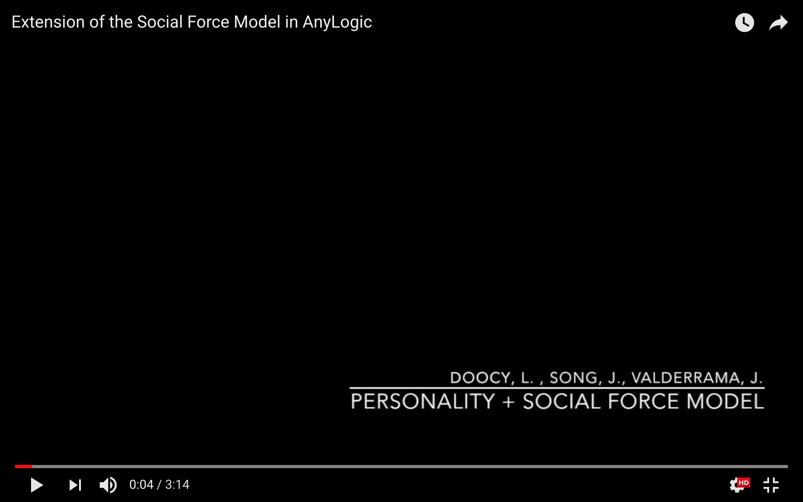

# Videos Folder

Click below for an example of the simulation in progress. The video demonstrates a replication of Helbing's original social force model, with distinct lane formation.

Camera navigation and interactive navigation tools adapted from Subway Entrance Hall example model in AnyLogic: https://help.anylogic.com/index.jsp?topic=%2Fcom.anylogic.help%2Fhtml%2F_PL%2Ftutorial%2FSubway_Entrance.html